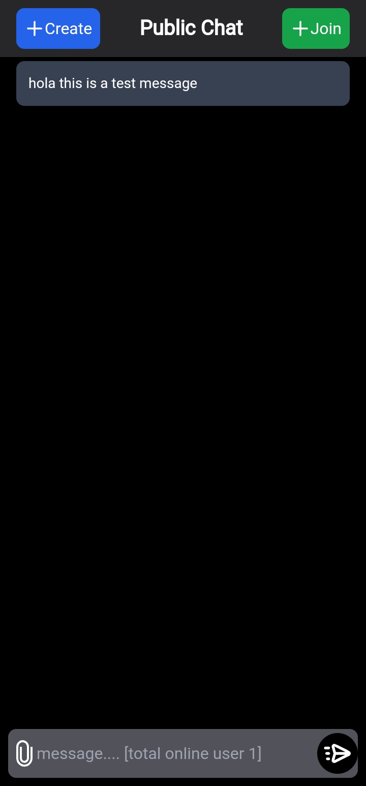

## Annonomus Chat Application 🚀

A real-time chat application with file upload capabilities, built using Flask, Socket.IO, jQuery, and Tailwind CSS.

## Features ✨

- Real-Time Chat: Join public or private rooms and exchange messages.
- File Upload: Upload and share images and videos.
- User Interface: Stylish UI with Tailwind CSS.

## Installation 🛠️

1. Clone the Repository:
   bash
   git clone https://github.com/bytebrain3/annonomus-chat-system-with-flask.git
   cd chat-application
   

2. Install Dependencies:
   bash
   pip install -r requirements.txt
   

3. Run the Application:
   bash
   python app.py
   

4. Open in Browser:
   Navigate to `http://localhost:5000` to use the app.

## Usage 💬

- Send Messages: Type in the message box and hit "Send".
- Upload Files: Click the file icon to select and upload files.

## Tech Stack 🛠️

- Backend: Flask, Socket.IO
- Frontend: jQuery, Tailwind CSS

